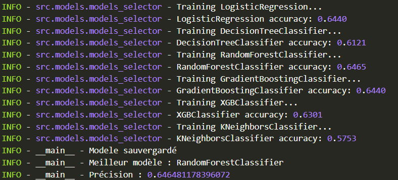
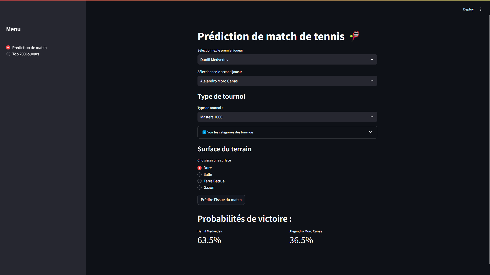
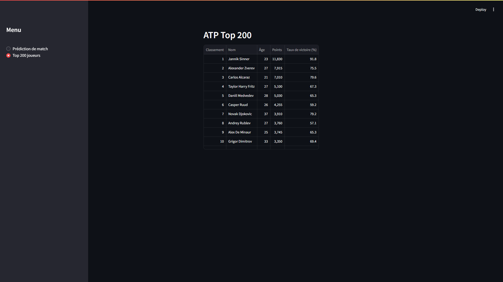

# Prédiction du gagnant d'un match de tennis

## Table des matières
- [Description](#description)
- [Scraping](#scraping)
- [Prétraitement des données (Preprocessing)](#prétraitement-des-données-preprocessing)
- [Machine Learning](#machine-learning)
- [Résultats du Machine Learning](#résultats-du-machine-learning)
- [Installation](#installation)
- [Utilisation de l'application](#utilisation-de-lapplication)
- [Auteurs](#auteurs)

---

## Description

L'objectif de ce projet est de collecter des données à partir de sites web en utilisant du webscraping, puis de les analyser pour prédire le vainqueur d'un match de tennis à l'aide de modèles de machine learning. Ce projet permet d'explorer des techniques de collecte, de traitement de données et d'apprentissage automatique appliquées à un domaine sportif.

Les données scrap proviennent du site : [https://www.tennisendirect.net/](https://www.tennisendirect.net/)

---

## Scraping

La collecte des données repose sur plusieurs scripts :

1. **Classement ATP**
   - Script : `scraping_classement.py`
   - Objectif : Extraire le classement actuel des joueurs de tennis de l'ATP.

2. **Profils des joueurs**
   - Script : `scraping_donnees_joueurs.py`
   - Objectif : Récupérer les informations suivantes pour chaque joueur :
     - Profil (nom, âge, nationalité, etc.)
     - Statistiques (ratio de victoires\défaites sur une surface pour une année)
     - Historique des 50 derniers matchs.

3. **Statistiques des matchs**
   - Script : `scraping_donnees_matchs.py`
   - Objectif : Extraire les statistiques individuelles de chaque match, telles que les pourcentages de premiers services, les aces, les points gagnants au premier service, etc.

---

## Prétraitement des données (Preprocessing)

Le prétraitement des données est réalisé en plusieurs étapes :

1. **Nettoyage des données**
   - Script : `data_clean.py`
   - Objectif : Supprimer les valeurs manquantes (NA) dans le fichier JSON `stats_matchs.json`.

2. **Création de datasets**
   - Script : `creation_dataset.py`
   - Objectif : Combiner les données des fichiers JSON collectés et ajouter des features décrivant les statistiques avant les matchs.

3. **Enrichissement des features**
   - Script : `creation_dataset_clean.py`
   - Objectif : Créer des features supplémentaires basées sur les différences statistiques entre deux joueurs, afin de constituer un dataset spécifique au machine learning.

4. **Dataset pour l'application**
   - Script : `creation_dataset_app.py`
   - Objectif : Produire un dataset adapté à l'utilisation dans l'application de prédiction.

---

## Machine Learning

### Objectif
Prédire le vainqueur d'un match de tennis à l'aide de modèles d'apprentissage automatique.

### Variable cible
- **Target** : Indique si le joueur 1 gagne ou perd le match.

### Variables sélectionnées

Les variables contenant un x (= 1,2) sont des variables qu'on utilise pour les 2 joueurs, et celles avec un i correspondent à plusieurs surfaces utilisées

| **Variable**                          | **Type**  | **Description**                                                                       |
| --------------------------------------| --------- | --------------------------------------------------------------------------------------|
| `player[x]_age`                       | int       | _Age du joueur_                                                                       |
| `player[x]_ranking`                   | int       | _Classement ATP du joueur_                                                            |
| `player[x]_point`                     | int       | _Points ATP du joueur_                                                                |
| `player[x]_win_rate`                  | float     | _Ratio victoires\défaites du joueur_                                                  |
| `player[x]_win_rate_3_sets`           | float     | _Ratio victoires\défaites des matchs en 3 sets du joueur_                             |
| `player[x]_win_rate_tiebreak`         | float     | _Ratio de tiebreak gagnés du joueur_                                                  |
| `player[x]_total_matches_[surface]`   | int       | _Nombre de match(es) sur une surface du joueur_                                       |
| `player[x]_win_rate_[surface]`        | float     | _Ratio de victoires\défaites sur une surface du joueur_                               |
| `player[x]_avg_first_serve_pct`       | float     | _Nombre moyen de premiers services du joueur_                                         |
| `player[x]_avg_first_serve_won_pct`   | float     | _Nombre moyen de premiers services gagnés du joueur_                                  |  
| `player[x]_avg_second_serve_won_pct`  | float     | _Nombre moyen de seconds services gagnés du joueur_                                   |
| `player[x]_avg_return_points_won_pct` | float     | _Nombre moyen de coups retournés gagnants du joueur_                                  |
| `player[x]_avg_break_point_won_pct`   | float     | _Nombre moyen de breakpoint du joueur_                                                |
| `player[x]_avg_double_fautes`         | float     | _Nombre moyen de double fautes du joueur_                                             |
| `player[x]_avg_aces`                  | float     | _Nombre moyen d'ace_                                                                  |
| `surface_[i]`                         | int       | _Nombre de matches joués du joueur sur une surface_                                   |
| `ranking_diff`                        | int       | _Différence de classement entre les deux joueurs_                                     |
| `points_diff`                         | int       | _Différence de points entre les deux joueurs_                                         |
| `win_rate_diff`                       | float     | _Différence de ratio de victoire moyen entre les deux joueurs_                        |
| `win_rate_diff_3_sets`                | float     | _Différence de ratio de victoire moyen des matches en 3 sets entre les deux joueurs_  |
| `win_rate_tiebreak_diff`              | float     | _Différence de ratio de victoire moyen en tiebreak entre les deux joueurs_            |
| `aces_diff`                           | float     | _Différence d'aces moyen entre les deux joueurs_                                      |
| `double_faults_diff`                  | float     | _Différence de doubles fautes moyennne entre les deux joueurs_                        |
| `win_rate_[i]_diff`                   | float     | _Différence de ratio de victoire moyen sur une surface entre les deux joueurs_        |

### Modélisation
- **Modèles testés** :
    - Script : `models.py`
    - Objectif : Tester 6 modèles différents et retenir celui avec la meilleure accuracy.

### Métrique de performance

- **Accuracy** :
  
    \[
    \text{Accuracy} = \frac{\text{TP} + \text{TN}}{\text{TP} + \text{TN} + \text{FP} + \text{FN}}
    \]

#### Explications des termes :

- **TP (Vrai Positif)** : Le modèle prédit correctement que le joueur 1 gagne le match.
- **TN (Vrai Négatif)** : Le modèle prédit correctement que le joueur 1 perd le match.
- **FP (Faux Positif)** : Le modèle prédit que le joueur 1 gagne, mais il perd en réalité.
- **FN (Faux Négatif)** : Le modèle prédit que le joueur 1 perd, mais il gagne en réalité.

#### Interprétation :

- Une **accuracy élevée** indique que le modèle effectue correctement la majorité des prédictions, qu'elles soient positives ou négatives.
- Cette métrique est particulièrement utile dans ce contexte pour évaluer la capacité du modèle à prédire correctement les résultats des matchs.

---

## Résultats du Machine Learning

- Notre meilleur modèle : Random Forest 

- Accuracy obtenue : 63.67%

 

- Sauvegarde du meilleur modèle dans le dossier `data\` : `best_model.joblib`
---

## Installation

Pour installer les dépendances et configurer l'environnement :

```bash
# Installer les dépendances
pip install uv

# Créer un environnement virtuel
uv venv

# Activer l'environnement virtuel
.venv\scripts\activate

# Synchroniser les dépendances
uv sync
```

---

## Utilisation de l'application

```bash
# Lancer l'application
streamlit run app\app.py
```

### Prédiction


- Pour comparer deux joueurs :
    - Sélectionner les joueurs à comparer
    - Chosir le type de tournoi
    - Choisir la surface de terrain
    - Cliquer sur `Prédire l'issue du match`
    - Et vous aurez les probabilités de victoires des deux joueurs




### Classement 

- Si vous voulez regarder le classement du top 200 :
    - Cliquer sur *Top 200 joueurs* dans la barre à gauche



---

## Auteurs

Ce projet a été réalisé par :
- *[Alexis SAVATON](https://github.com/AlexisSVTN)*
- *[Raphaël MERCIER](https://github.com/pARHA-CS)*

